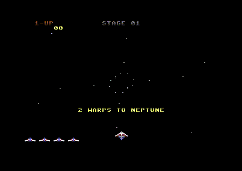
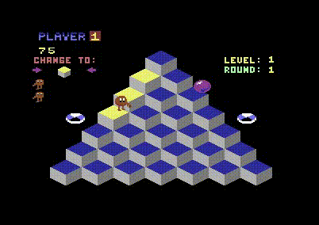
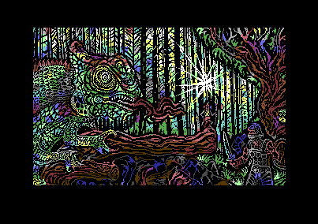

# caio - 8 bits home computers emulator

caio is an emulator of hardware platforms with a strong focus on old 8 bits
home computers.

The goal of caio is to provide a single core architecture able to emulate
several different hardware platforms. To do that, the chip-set used by those
platforms are emulated.

For more information about caio refer to the
[development documentation](doc/devel.md).


## Status

caio is currently in alpha state, it is **work-in-progress** and at the
moment only the [Commodore 64](https://en.wikipedia.org/wiki/Commodore_64)
is emulated, under Linux and MacOS.

The emulation of the
[Commodore 64](https://en.wikipedia.org/wiki/Commodore_64) almost reached a
beta status and most of the tested programs work just fine (if they do not
exploit obscure video/timing tricks or trigger some bug ;).

See the [releases](#releases) section below.






[](https://csdb.dk/release/?id=188005)


## Compile, install and packaging

### Dependencies

#### Linux:

```
    $ sudo apt install clang pkg-config libsdl2-dev libsdl2-image-dev
    ...
```

#### MacOS:

[xcode](https://developer.apple.com/xcode), xcode command line tools, and
[brew](https://brew.sh) must be installed.

```
   $ brew install pkg-config sdl2 sdl2_image
   ...
```

### Compile

```
    $ make PREFIX=/usr/local all
    ...
    $ sudo make PREFIX=/usr/local install
    ...
```

The default value for the `PREFIX` make variable is `/opt/caio`.

For more information read the
[compile, install and packaging documentation](doc/compile.md).


## Usage & Configuration

There are three ways to launch the emulator, two of them from the console:

```
    $ caio c64 --help
```
or

```
    $ c64 --help
```

All the command line options can be specified in a
[configuration file](src/main/caio.conf).

Examples:

The following command activates the horizontal scanlines visual effect, scales
up the emulated screen resolution 4 times (that is, a 320x200 screen is scaled
up to 1280x800), loads and launches the cartridge named *gyruss*:

```
    $ c64 --scanlines h --scale 4 --cart ./gyruss.crt
```

The next command injects a `PRG` program into memory and launches it as soon
as the basic is started:

```
    $ c64 --prg ./rambo.prg
```

Note that this won't work for advanced or big program files that overwrite
memory areas not configured as RAM.

Under linux, a third way the emulator can be launched is from a GUI
(like a file manager), in this case the logs must not be sent to the terminal
(there won't be one), if that happens the emulator is silently terminated as
soon as it is started (see the `logfile` configuration file option).

For more information about usage, keyboard mappings, joysticks, etc. read the
[usage documentation](doc/usage.md).


## Releases

The first beta release will contain the following emulators:

* [Commodore 64](https://en.wikipedia.org/wiki/Commodore_64)
* [Sinclair ZX80](https://en.wikipedia.org/wiki/ZX80)

There is no date for this release.

There could be pre-releases containing alpha versions of the emulators under
development. No dates for these.

It is desired for future releases to provide emulation for:

* [Amstrad CPC-464](https://en.wikipedia.org/wiki/Amstrad_CPC_464)
* [Apple-2](https://en.wikipedia.org/wiki/Apple_II)
* [BBC Micro](https://en.wikipedia.org/wiki/BBC_Micro)
* [Daewoo DPC-200](https://www.msx.org/wiki/Daewoo_DPC-200)
* [NEC PC-8001](https://en.wikipedia.org/wiki/PC-8000_series#PC-8001)
* [Sinclair ZX Spectrum](https://en.wikipedia.org/wiki/ZX_Spectrum)


## Old hardware

If you have some old home computer and want to donate it, I will gladly accept
it even if it is not working. Please let me know.

