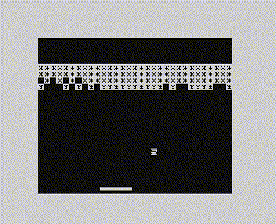

# caio - 8-bit home computers emulator

caio is an emulator of hardware platforms with a strong focus on old 8-bit
home computers.

At the moment the following platforms are emulated:

- Commodore 64
- NES
- Sinclair ZX-80
- Sinclair ZX-Spectrum 48K

### Commodore 64

The emulation of the [Commodore 64](https://en.wikipedia.org/wiki/Commodore_64)
reached beta status. Most of the tested programs work (there are still some
issues with few advanced games that use specific video/timing tricks). 
It supports audio, joystick interfaces, the cartridge CRT format, and the
C1541 disk drive unit (read and write), the D64 file format is not supported
yet.

### NES (Nintendo Entertainment System)

The emulation of the [NES](https://en.wikipedia.org/wiki/Nintendo_Entertainment_System)
platform is completed but not all the cartridge
[mappers](https://www.nesdev.org/wiki/Mapper) are implemented, yet.
The [Family BASIC keyboard](https://en.wikipedia.org/wiki/Family_BASIC)
is supported. 
Only the NTSC version of this machine is supported so games for the USA and
Japan markets should run without any problems.

### Sinclair ZX-80

The [Sinclair ZX-80](https://en.wikipedia.org/wiki/ZX80) came with 4K ROM
and 1K RAM. Soon after its introduction several RAMPACKs appeared, these
extended the RAM up to 16K. 
When the ZX-81 came out, its 8K ROM was also available for the ZX-80. 
caio supports the original configuration, the 16K RAM extension and
the 8K ROM. 
Tape files .O and .P are supported (read and write).

### Sinclair ZX-Spectrum 48K

The emulation of the
[Sinclair ZX-Spectrum 48K](https://en.wikipedia.org/wiki/ZX_Spectrum)
reached beta status. Only the 48K version of this machine is emulated. 
caio supports the integrated 1 bit audio, the Kempston joystick interface,
the cassette TAP file format (read and write) and snapshot files Z80 and SNA.

## Host platforms

At the moment the supported host platforms are Linux and macOS. 

## Compile & Install

Refer to the [Compile & Install](doc/compile.md) guide.

## Usage & Configuration

Refer to the [Usage & Configuration](doc/usage.md) guide.

## Release

The first release is underway and it includes the following platforms:

* [Commodore 64](https://en.wikipedia.org/wiki/Commodore_64)
* [NES (Nintendo Entertainment System)](https://en.wikipedia.org/wiki/Nintendo_Entertainment_System)
* [Sinclair ZX-80](https://en.wikipedia.org/wiki/ZX80)
* [Sinclair ZX-Spectrum 48K](https://en.wikipedia.org/wiki/ZX_Spectrum)

Desired for future releases:

* [Amstrad CPC-464](https://en.wikipedia.org/wiki/Amstrad_CPC_464)
* [Apple-2](https://en.wikipedia.org/wiki/Apple_II)
* [BBC Micro](https://en.wikipedia.org/wiki/BBC_Micro)
* [Daewoo DPC-200](https://www.msx.org/wiki/Daewoo_DPC-200)
* [NEC PC-8001](https://en.wikipedia.org/wiki/PC-8000_series#PC-8001)

