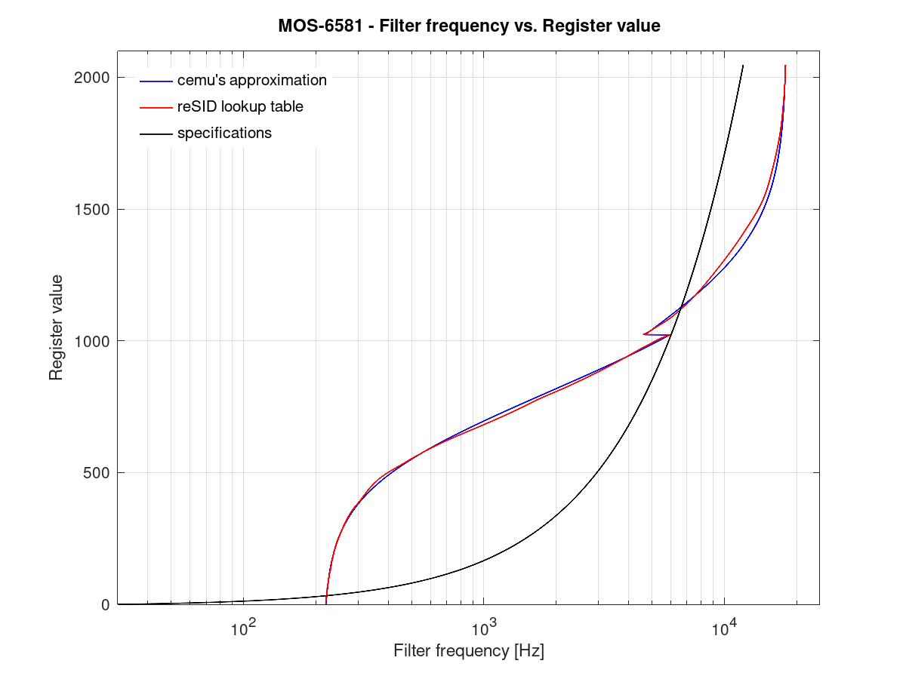

# caio - 8 bits home computers emulator

## MOS 6581

The very first implementation of the
[MOS 6581](https://en.wikipedia.org/wiki/MOS_Technology_6581) chip was
entirely based on the specifications found on the
[C64 User's Guide](https://www.c64-wiki.com/wiki/Commodore_64_User%27s_Guide),
since ["Many characteristics of the SID sound are bugs"](https://www.c64-wiki.com/wiki/SID#Trivia)
that implementation did not sound 100% like the original chip.

The current version of this device evolved a lot since its first incarnations
reaching better levels of emulation accuracy.
Still, it is  is far for being *really good* so another implementation based
on the [reSID](https://en.wikipedia.org/wiki/ReSID) library is also provided.

### filters:

The specifications say that actual filter frequencies are defined by the
following formula:

```
  fc = FC_MIN + (FC_MAX - FC_MIN) * ufc / 2048
```

where `ufc` is the 11-bits frequency value set by the user. Unfortunately,
this formula is not correct. The relationship between the user defined
values and the actual filter frequency is non-linear and every single SID
chip out there sounds different from another.

It seems that the author of [reSID](https://en.wikipedia.org/wiki/ReSID) did
some reverse engineering work and came out with a lookup table used to
translate from the user defined values to the actual filter frequencies.

In caio's implementation, this curve is approximated using two
[sigmoid functions](https://en.wikipedia.org/wiki/Sigmoid_function).

The plot below shows the lookup table used by the reSID, the approximated
function used by caio, and the formula described in the SID's technical
specifications:



The resonance value is also translated to a quadratic response Q factor,
again, the author of the reSID library found that its value varies from
0.707 to 1.7.
caio's implementation uses the following formula to calculate the actual
Q factor:

```
  Q = 0.707 + (1.7 - 0.707) * res / 15

```
where `res` is the 4-bits resonance value specified by the user.

### other bugs:

The volume *click* bug and others are implemented so programs like
[SAM](https://en.wikipedia.org/wiki/Software_Automatic_Mouth) work.
