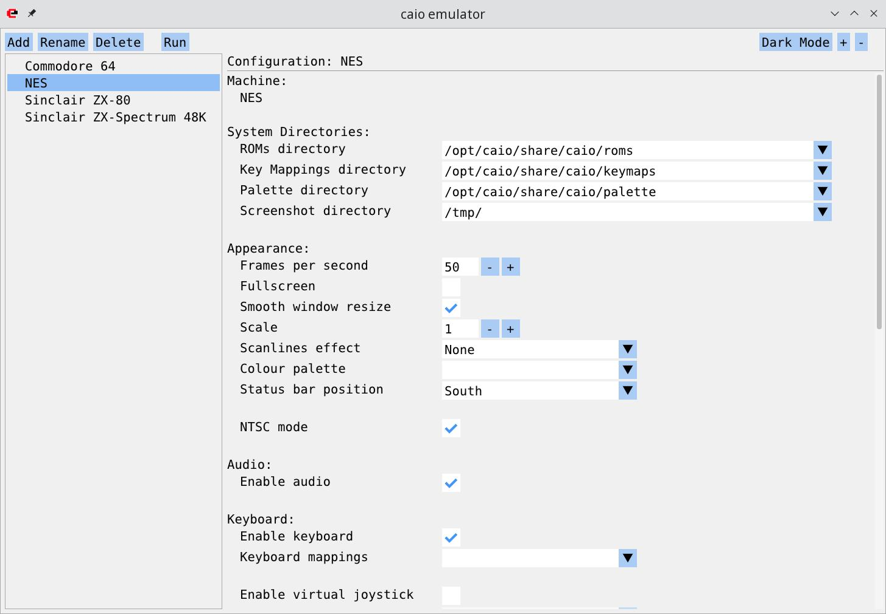
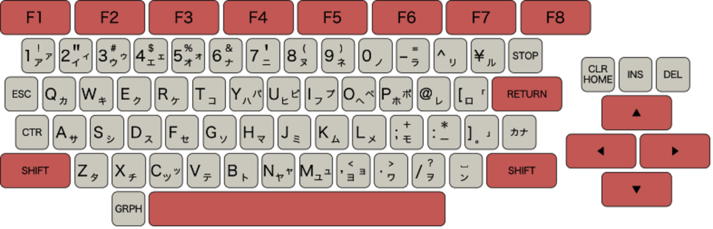
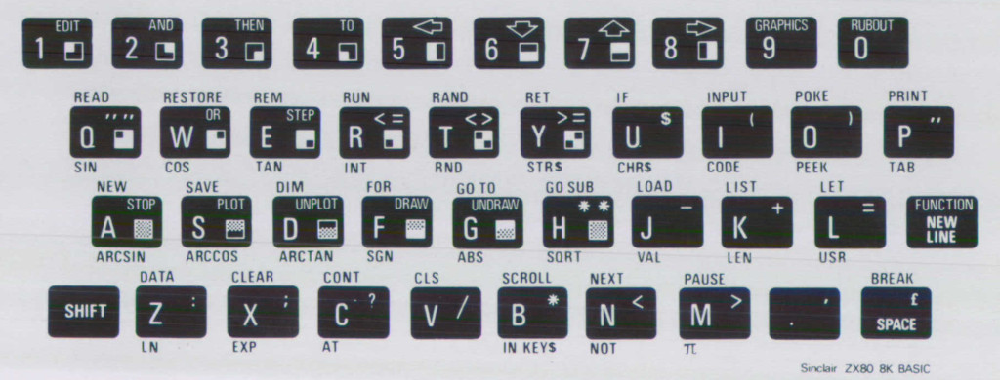
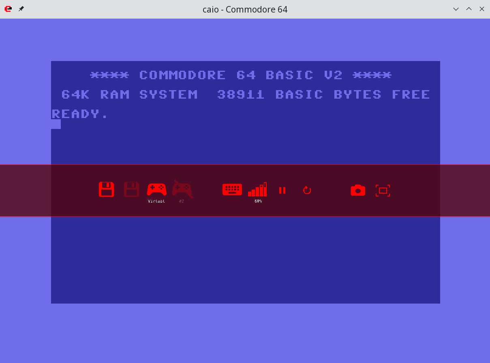

# caio - 8-bit home computers emulator

## Usage & Configuration

caio can be launched from a file browser or from a command line terminal.

### Launching caio from a file browser

When caio is installed in the system its icon should be visible from any
file browser. When launched, a configurator GUI appears:

<p align="center">

</p>

The upper left corner contains buttons `Add`, `'Rename', Delete`, and `Run`,
these are used to add, rename, delete, and run machine configurations
respectively.

The left pane below the buttons contains a selectable a list of machines
and the right pane shows the specific configuration values for the selected
entry.

The upper right corner of the main window contains buttons to change from
_Dark mode_ to _Light mode_ and vice versa, and buttons to increase/decrease
the font size which can also be changed using **CTRL +** and **CTRL -**
(under macOS it would be **command &#8984; +** and **command &#8984; -**).

User defined configurations are stored in the `$HOME/.config/caio/` directory.
<br>
Note that this directory is *not* removed when caio is uninstalled from the
system.


### Launching caio from a command line terminal

```
$ caio --help
usage: caio <arch> [--help]
where arch is one of:
c64
nes
zx80
zxspectrum
```

<details>
<summary>Generic Configuration</summary>

#### Generic Configuration

Configuration parameters can be specified as command line options or as
*key-value* pairs in a [configuration file](../src/main/caio.conf).
<br>
The configuration file contains two types of sections: One ***generic***
section whose values are inherited by all platforms, and one ***specific***
section for each emulated platform.
<br>
If a parameter is specified twice (as platform specific and generic), the
platform specific value takes the precedence.

The configuration file is searched in the following places (stop at first
match):

1. Command line option:              `--conf`
2. User's configuration directory:   `$HOME/.config/caio/caio.conf`
3. System's configuration directory: `$PREFIX/etc/caio/caio.conf`

Command line options take precedence over those defined in the configuration
file.

Generic options as command line parameters:

```
 --conf <cfile>          Configuration file
 --romdir <romdir>       ROMs directory
 --palettedir <pdir>     Colour palette directory
 --palette <palette>     Colour palette name or filename
 --keymapsdir <kdir>     Key mappings directory
 --keymaps <keymaps>     Key mappings name or filename
 --cart <cfile>          Cartridge filename
 --fps <rate>            Frame rate (default is 50)
 --scale <scale>         Window scale factor (default is 1)
 --scanlines <n|h|v|H|V> Scanlines effect: (n)one, (h)orizontal, (v)ertical,
                         advanced (H)orizontal, advanced (V)ertical
                         (default is n)
 --fullscreen [yes|no]   Start in fullscreen mode
 --sresize [yes|no]      Smooth window resize (default is yes)
 --audio [yes|no]        Enable audio (default is yes)
 --delay <delay>         Clock delay factor (default is 1)
 --monitor [yes|no]      Activate the CPU monitor (default is no)
 --logfile <file>        Send log information to the specified destination
                         (default is /dev/null)
 --loglevel <lv>         Loglevel, bitwise combination of:
                         none|error|warn|info|debug|all (default is none)
 --keyboard [yes|no]     Enable keyboard at startup (default is yes)
 --vjoy [yes|no]         Enable virtual joystick (default is no)
 --vjoy-up <keyname>     Virtual joystick UP key (default is KEY_NUMPAD_8)
 --vjoy-down <keyname>   Virtual joystick DOWN key (default is KEY_NUMPAD_2)
 --vjoy-left <keyname>   Virtual joystick LEFT key (default is KEY_NUMPAD_4)
 --vjoy-right <keyname>  Virtual joystick RIGHT key (default is KEY_NUMPAD_6)
 --vjoy-fire <keyname>   Virtual joystick FIRE key (default is KEY_NUMPAD_5)
 --vjoy-a <keyname>      Virtual joystick A key
 --vjoy-b <keyname>      Virtual joystick B key
 --vjoy-x <keyname>      Virtual joystick X key
 --vjoy-y <keyname>      Virtual joystick Y key
 --vjoy-back <keyname>   Virtual joystick BACK key
 --vjoy-guide <keyname>  Virtual joystick GUIDE key
 --vjoy-start <keyname>  Virtual joystick START key
 --screenshotdir <sdir>  Screenshot directory (default is ~/Desktop)
 --statusbar <pos>       Status bar position, one of:
                         none, center, north, south, east, west,
                         north-east, north-west, south-east, south-west
                         (default is "south")
 -v|--version            Show version information and exit
 -h|--help               Print this message and exit
```

#### Keyboard layout

The keyboard layout depends on the emulated platform at it is set using the
`keymaps` configuration option.
<br>
By default, keyboard mappings are stored in the `$FREFIX/share/caio/keymaps/`
directory in the form of text files. This directory can be changed using the
`keymapsdir` option.
<br>
The user can define new mappings by adding files into this directory.

#### Joysticks and Gamepads

##### Gamepads:

When a gamepad is detected it is automatically connected to an emulated
joystick port.

##### Virtual joystick:

A virtual joystick is available and it can be enabled using the `vjoy`
configuration option. The default mappings are:
- Up: `KEY_NUMPAD_8`
- Down: `KEY_NUMPAD_2`
- Left: `KEY_NUMPAD_4`
- Right: `KEY_NUMPAD_3`
- Fire: `KEY_NUMPAD_5`

These mappings can be changed using parameters: `vjoy_up`, `vjoy_down`,
`vjoy_left`, `vjoy_right`, and `vjoy_fire`.

When the virtual joystick is enabled it is automatically connected to an
emulated joystick port.

<hr>
</details>
<details>
<summary>Commodore 64</summary>

### Commodore 64

```
$ caio c64 --help
usage: c64 <options> [<file>]
where <file> is the name of a program, cartridge or
snapshot to launch (the file format is auto-detected)
and <options> are:
 ...
Commodore C64 specific:
 --prg <prg>             Load a PRG file as soon as the basic is ready
 --swapj [yes|no]        Swap Joysticks (default is no)
 --unit8 <dir>           Attach a disk drive as unit 8
 --unit9 <dir>           Attach a disk drive as unit 9
```

#### Keyboard layout

The following keyboard layouts are available for the C64:

* [Italian (it)](https://upload.wikimedia.org/wikipedia/commons/e/e5/Italian_Keyboard_layout.svg)
* [German (de)](https://en.wikipedia.org/wiki/QWERTZ#/media/File:German-Keyboard-Layout-T2-Version1-large.png)
* [Swiss (ch)](https://en.wikipedia.org/wiki/QWERTZ#/media/File:KB_Swiss.svg)
* [UK (gb)](https://upload.wikimedia.org/wikipedia/commons/d/da/KB_United_Kingdom.svg)
* [US-ANSI (default)](https://upload.wikimedia.org/wikipedia/commons/3/37/ANSI_Keyboard_Layout_Diagram_with_Form_Factor.svg)
* [VICEKB (vice)](https://vice-emu.pokefinder.org/images/b/b8/C64keyboard.gif)

Like the [VICE](https://en.wikipedia.org/wiki/VICE) emulator, the `RESTORE`
key is mapped as `Page-Up`, `RUN/STOP` as `ESC`, `CTRL` as `TAB` and
`CBM` as `LEFT-CTRL`.

For example, to use the italian layout:

```
$ caio c64 --keymaps it
```

To use the vice positional layout:

```
$ caio c64 --keymaps vice
```

#### Joysticks

The Commodore 64 has two joystick ports. If a gamepad is detected it is
attached to one of these ports. If the virtual joystick is also enabled
one port is associated to the gamepad and the other to the virtual
joystick.

Unexpected results could occur when the same key is shared by both the
emulated keyboard and the virtual joystick (both try to process the same
keystroke). To help deal with this situation the state of the emulated
keyboard can be toggled (activated/deactivated) at runtime using the
`ALT-K` key combination.
<br>
Games or other applications that use the keyboard in conjunction with the
virtual joystick should never share the same keys. If the default virtual
joystick keys are not available or just difficult to use, the user is always
free to redefine both the keyboard keys and the virtual joystick as desired.

For more information refer to the Generic Configuration section.

#### Disk drives

There is an implementation of the
[C1541](https://en.wikipedia.org/wiki/Commodore_1541) disk drive unit that
access the host filesystem. Host directories are recursively traversed so it
must be used with care.
<br>
Configuration options `unit8` and `unit9` are be used to associate a host
directory to a floppy disk.

`D64` disk drive images are not supported yet.

#### Examples

The following command activates the horizontal scanlines visual effect, scales
up the emulated screen resolution 3 times (that is, a 320x200 screen is scaled
up to 960x600), loads and launches the cartridge named *ghostsngoblins*:

```
$ caio c64 --scanlines h --scale 3 --cart /games/c64/ghostsngoblins.crt
```

The next command activates the advanced horizontal scanlines visual effect
(note the captial H), in this mode the specified scale factor is doubled
(that is, a 320x200 screen is scaled up to 1280x800), loads and launches the
cartridge named *Simon's Basic*:

```
$ caio c64 --scanlines H --scale 2 --cart /apps/c64/simons_basic.crt
```

The next command loads and run a `PRG` program:

```
$ caio c64 --scale 3 --prg /games/c64/rambo.prg
```

The program is injected directly into RAM while the emulator is suspended,
this means that the previous command won't work with advanced or big files
that are expected to overwrite memory areas not configured as RAM. In that
case configuration options `unit8` and `unit9` must be used as follows:

```
$ caio c64 --scale 3 --unit8 /games/c64
```

then, from basic:

```
LOAD "RAMBO",8,1
```

Cartridges and programs can be specified without using their specific
command line options, in this case the format is auto-detected:

```
$ caio c64 --scale 3 /games/c64/ghostbusters.crt
```

<hr>
</details>
<details>
<summary>NES (Nintendo Entertainment System)</summary>

### NES (Nintendo Entertainment System)

```
$ caio nes --help
usage: nes <options> [<file>]
where <file> is the name of a program, cartridge or
snapshot to launch (the file format is auto-detected)
and <options> are:
 ...
NES (Nintendo Entertainment System) specific:
 --ntsc [yes|no]         Use the resolution of an old NTSC TV set
                         (default is yes)
 --swapj [yes|no]        Swap Joysticks (default is no)
 --button-up <bt>        Map the controller UP button to a gamepad button
                         (default is UP)
 --button-down <bt>      Map the controller DOWN button to a gamepad button
                         (default is DOWN)
 --button-left <bt>      Map the controller LEFT button to a gamepad button
                         (default is LEFT)
 --button-right <bt>     Map the controller RIGHT button to a gamepad button
                         (default is RIGHT)
 --button-a <bt>         Map the controller A button to a gamepad button
                         (default is A)
 --button-b <bt>         Map the controller B button to a gamepad button
                         (default is B)
 --button-select <bt>    Map the controller SELECT button to a gamepad button
                         (default is GUIDE)
 --button-start <bt>     Map the controller START button to a gamepad button
                         (default is START)
 where <bt> is one of:
 UP, DOWN, LEFT, RIGHT, FIRE, A, B, X, Y, START, BACK, GUIDE
```

#### Keyboard layout

NES Family BASIC keyboard layout:

<p align="center">
<a href="https://www.nesdev.org/wiki/File:Family_keyboard.svg">

</a>
</p>

The default key mappings is positional, with the exception of the following
keys:
```
 NES Keyboard    PC Keyboard
-----------------------------------
 STOP            BACKSLASH \
 CTR             TAB
 ]               ALTGR ;
 KANA            ALTGR '
 _               ALTGR+SHIFT /
 GRPH            Left CTRL
 YEN             ` (GRAVE ACCENT)
```

#### Joysticks

Both standard NES controller ports are supported. If the virtual joystick
is enabled, the first port is assigned to it and the second port is assigned
to an eventual gamepad. This default can be reverted using the `swapj`
option or the `ALT-J` key combination.

#### Examples

The following command scales up the emulated screen resolution 3 times
(that is, a 256x224 screen is scaled up to 768x672), loads and launches
the cartridge named *Super Mario Bros.*

```
$ caio nes --scanlines n --scale 3 --cart /games/nes/super_mario_bros.nes
```

The next command activates the advanced horizontal scanlines visual effect
(note the captial H), in this mode the specified scale factor is doubled
(that is, a 256x224 screen is scaled up to 1024x896), loads and launches the
cartridge named *Castelvania*:

```
$ caio nes --scanlines H --scale 2 --cart /games/nes/castelvania.nes
```

<hr>
</details>
<details>
<summary>Sinclair ZX-80</summary>

### Sinclair ZX-80

```
$ caio zx80 --help
usage: zx80 <options> [<file>]
where <file> is the name of a program, cartridge or
snapshot to launch (the file format is auto-detected)
and <options> are:
 ...
Sinclair ZX80 specific:
 --ram16 [yes|no]        Attach a 16K RAM instead of the default 1K RAM
 --rom8 [yes|no]         Attach the 8K ROM instead of the default 4K ROM
 --rvideo [yes|no]       Reverse video output
 --cassdir <dir>         Set the basic save/load directory (default is ./)
 --prg <.o|.p>           Load a .o/.p file as soon as the basic is started
```

The [Sinclair ZX-80](https://en.wikipedia.org/wiki/ZX80) came with 4K ROM
and 1K RAM. Soon after its introduction several RAMPACKs appeared, these
extended the RAM up to 16K.<br>
When the ZX-81 came out, its 8K ROM was also available for the ZX-80.<br>
caio supports the original configuration, the 16K RAM extension and
the 8K ROM.

#### Keyboard layout

The default keyboard layout is positional and depends on the installed ROM:

4K ROM keyboard layout:

<p align="center"></p>

8K ROM keyboard layout:

<p align="center"></p>

#### Cassette interface

The cassette interface is supported. It associates an emulated tape to a
directory in the host filesystem so files contained there are considered
part of a single big tape.

Cassette file formats
[.O](https://problemkaputt.de/zxdocs.htm#zx80zx81cassettefileimages) (4K ROM)
and [.P](https://problemkaputt.de/zxdocs.htm#zx80zx81cassettefileimages)
(8K ROM) are supported. Audio files (WAV, PCM, etc.) are not supported.

The behaviour of _BASIC_ commands `LOAD` and `SAVE` depend on the ROM being
used:
- 4K ROM: The filename is **always** set to `basic.o` and it is located under
  the cassette directory. Because of this, a `SAVE` operation overwrites any
  previously existing `basic.o` file.
- 8K ROM: In the case of a `SAVE` operation, a file is created in the cassette
  directory using the name specified by the user.
  In the case of a `LOAD` operation, the content of all ***.p*** files present
  inside the cassette directory are concatenated into a continuous sequence of
  bytes emulating a real tape.

See the `cassdir` configuration option.

#### Preloading programs

The `prg` configuration option can be used to automatically load a program as
soon the basic is started by-passing the slow cassette interface.
For example:

```
$ caio zx80 --scale 2 --ram16 --prg /games/zx80/ZX80.4K.ROM.Pacman.o
```

Programs can be specified without the `--prg` command line option, in this
case the format is auto-detected:

```
$ caio zx80 --scale 2 --ram16 --rom8 yes /games/zx80/ZX80.8K.ROM.Kong.o
```

#### Software

The following site has not only good information about the internals
of the machine but it is also the main site of really beautiful games
that exploit the flicker-free technique:
[ZX Resource Centre](http://www.fruitcake.plus.com/Sinclair/ZX80/FlickerFree/ZX80_DisplayMechanism.htm "ZX Resource Centre").

<hr>
</details>
<details>
<summary>Sinclair ZX-Spectrum 48K</summary>

### Sinclair ZX-Spectrum 48K

```
$ caio zxspectrum --help
usage: zxspectrum <options> [<file>]
where <file> is the name of a program, cartridge or
snapshot to launch (the file format is auto-detected)
and <options> are:
...
Sinclair ZX-Spectrum 48K specific:
 --tape <fname|dir>      Set the input tape file (TAP) or directory
 --otape <fname|dir>     Set the output tape file (TAP) or directory
                         (default is ./)
 --fastload [yes|no]     Fast tape loading (default is no)
 --snap <fname>          Load a snapshot image (Z80 or SNA formats)
```

#### Keyboard layout

The default keyboard layout is positional:

<p align="center">
<a href="https://upload.wikimedia.org/wikipedia/commons/3/33/ZXSpectrum48k.jpg">

</a>
</p>

The `CAPS SHIFT` key is mapped as `SHIFT` and the `SYMBOL SHIFT` key
is mapped as `CTRL`.

#### Joysticks

The ZX-Spectrum does not have native joystick ports. External devices from
various vendors were used to add joystick support to this machine. One of the
most common of these devices is the
[Kempston](https://en.wikipedia.org/wiki/Kempston_Micro_Electronics)
joystick interface which caio supports.

If the virtual joystick is enabled (`vjoy` configuration option), the
Kempston interface is automatically connected to it. If a gamepad is
detected and the virtual joystick is **not** enabled then the Kempston
interface is connected to it.

For more information refer to the Generic Configuration section.

#### Cassette interface

The cassette interface is emulated and it supports the
[TAP](https://sinclair.wiki.zxnet.co.uk/wiki/TAP_format) file format.
Audio files (WAV, PCM, etc.) are not supported.
<br>
The cassette interface can be specified as a file or as a directory
and there are two configuration options:

- `tape`: Sets the input tape (*LOAD*)<br>
If a directory is specified as input tape, the content of a number of *TAP*
files found inside it are concatenated creating a big virtual *TAP* which
is used as input tape.

- `otape`: Sets the output tape (*SAVE*)<br>
If a directory is specified as output tape, any SAVE operation creates
a new *TAP* file inside it.<br>
If a file is specified as output tape, any SAVE operation appends data
to it.

The following command specifies the file *starquak.tap* as input tape:

```
$ caio zxspectrum --fastload --tape /games/spectrum/starquak.tap
```

The `fastload` option is used to disable time emulation during cassette
load operations.

In order to load and run the program stored inside that tape, the command
shown below must be entered from *BASIC*:

```
LOAD ""
```

#### Snapshots

The `snap` option can be used to load a snapshot file.
Supported formats are [SNA](https://sinclair.wiki.zxnet.co.uk/wiki/SNA_format)
and [Z80](https://sinclair.wiki.zxnet.co.uk/wiki/Z80_format).
<br>
The following command launches the game called *Jet Set Willy* which is
embedded inside a snapshot:

```
$ caio zxspectrum --snap /games/spectrum/Jet.Set.Willy.z80
```

Snapshots can be specified without using the `--snap` command line option,
in this case the format of the snapshot file is auto-detected:

```
$ caio zxspectrum /games/spectrum/elite.z80
```

<hr>
</details>

## Interacting with the emulator

When a specific machine is launched (using one of the methods explained
in the previous section) a new window appears running the specified emulated
platform.

### Hot-Keys

The following key combinations are accepted:

* `ALT-F` toggles between *windowed* and *fullscreen* modes.
* `PAUSE` or `ALT-P` toggles between *pause* and *running* modes.
* `ALT-J` swaps joysticks #1 and #2.
* `ALT-K` toggles the status of the emulated keyboard (active/inactive).
* `ALT-V` toggles the visibility of the info panel.
* `ALT-SHIFT-S` takes a screenshot.
* `CTRL-C` on the terminal enters the CPU monitor (if the monitor is not
  active the emulation is terminated).

Under macOS the **command &#8984;** key must be used instead of the
**ALT** key.

### Info Panel

The Info Panel is an informational panel containing widgets used to show
status information of emulated devices and to control some aspects of the
emulator (audio volume setting, pause, reset, etc.).
<br>
The Panel can be made visible/invisible clicking the mouse right button
or using the `ALT-V` key combination.
<br>
The default panel widgets that appear on the screen are (from right to left):

* Toggle Fullscreen mode
* Platform reset
* Suspend/Resume emulation
* Audio Volume control

There are other widgets that depend on the specifc emulated platform, such as:

* Joystick status
* Disk drive status
* Cassette status

<br>
<p align="center">

</p>

The panel above shows the Commodore 64 disk drive unit 8 active, disk drive
unit 9 disabled, joystick port #1 enabled and connected to the virtual
joystick, it is not swapped with joystick port #2 which is disabled.

### Status Bar

Besides the Info Panel, there is a small status bar that appears when the
state of one or more devices is changed (disk activity, tape activity, etc.).

This bar appears only when the Info Panel is not shown and its position
on the screen can be configured by the user.

<p align="center">

</p>

### Joysticks

As explained in the Configuration section, when a gamepad is detected and
the emulated platform supports one or more joystick ports, the gamepad is
assigned to one of those ports.
<br>
When the virtual joystick is enabled and the emulated platform supports one
or more joystick ports, the virtual joystick is assigned to one of those
ports.

When a gamepad is detected and the virtual joystick is enabled and the
emulated platform supports more than one joystick port, the virtual joystick
is assigned to one port and the gamepad to the other.

Some platforms (such as the Commodore 64) share the internal keyboard matrix
with joystick ports, this means that a virtual joystick sharing keys with the
emulated keyboard can negatively interfere with it.
Please refer to the specific platform configuration section to learn more
about the virutal joystick and possible issues with the keyboard.

